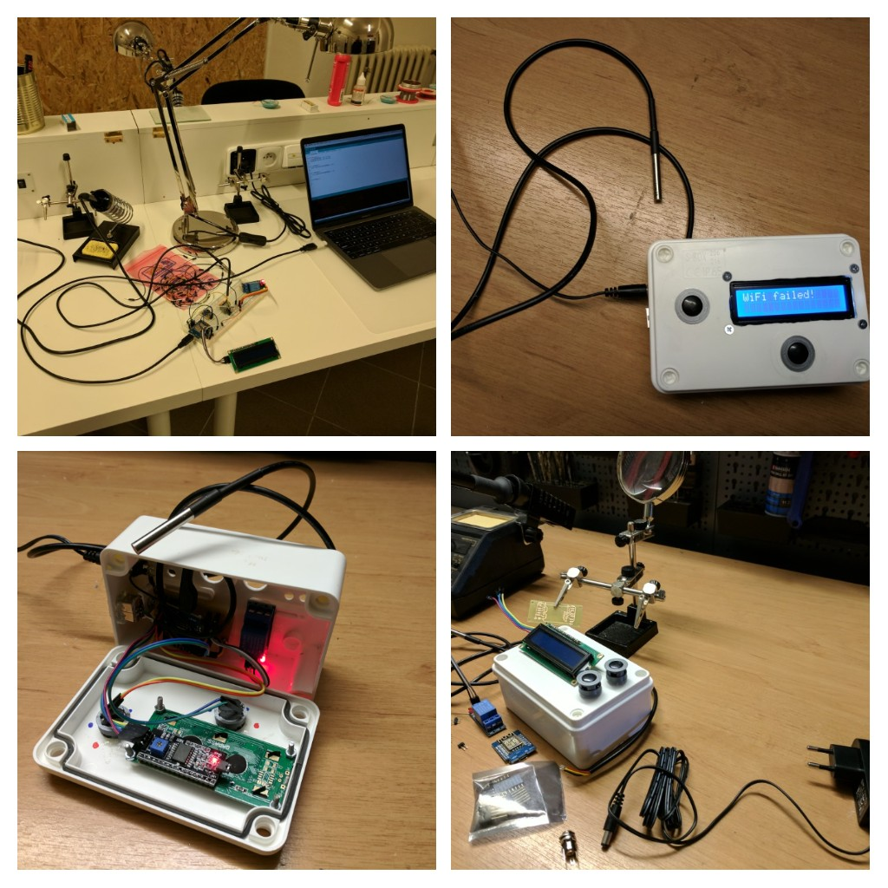

# kotiheating-arduino

IoT KotiHeating project for remote heating control realized with Arduino HW.

## Functionality

KotiHeating offers 3 heating modes:
1) OFF - heating is set to non-freezing level (5°C)
2) MANUAL - allows set heating level from 18°C to 28°C
3) AUTOMATIC - reads temperature from locally saved matrix

## WiFi Connectivity

KotiHeating exposes following endpoints via WIFI:
- TBD.
- TBD.

## Internet Connectivity

Kotiheating is periodically connecting to server endpoint to update AUTOMATIC matrix 
and to save last known state of the device.

Server matrix can be changed on the server TBD.

Server expose last known state of the KotiHeating via API TBD.

### HTTPS connection

#### Cipher suite supported by device
Current solution is for chip ESP8266.
This chip supports TLS1.1 only and only in these two variants:
1)TLS_RSA_WITH_AES_256_CBC_SHA
2)TLS_RSA_WITH_AES_128_CBC_SHA

You can check your device running this program on it:
 `http.begin("https://www.howsmyssl.com/a/check", "4D 05 9F 78 25 B2 82 98 3A B9 4D 4D 41 71 FA D3 DF C4 65 B9");`

#### Cipher cuite supported by server
Then check which ciphers has been supported by server (kotopeky.cz in my case):
 
`nmap --script ssl-enum-ciphers -p 443 kotopeky.cz`
 
 If you find device's suite in the server's table, everything is ok.
 Otherwise you have to force server to support also device's cipher, or change device to fit server's cipher suite.
 
#### Key Fingerprint
 
If server's and device's cipher match. 
Then start connection using SHA1 fingerprint (look at the safari status bar for example).
In my case it's this:
 
 `http.begin("https://kotopeky.cz/api/kotinode/heating/status","63 FD D7 BB B4 A5 6C 00 57 0F 23 A2 FD 27 15 96 4A C2 4D 99");`